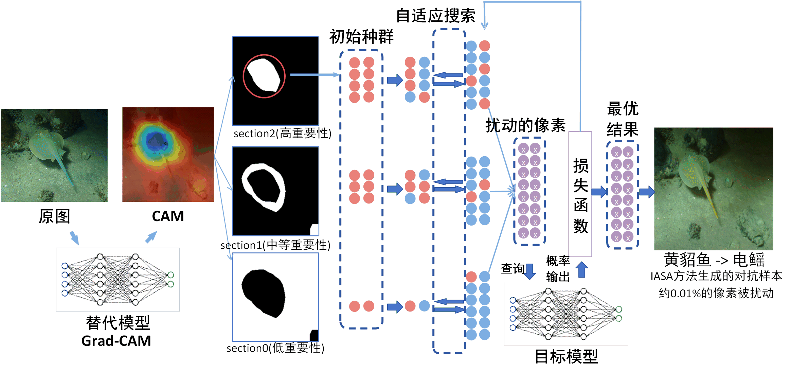

# IASA - Implementation and Evaluation

## Overview

This repository contains the implementation of the IASA algorithm along with evaluation frameworks for both the proposed method and baseline approaches.

## Repository Structure

- `eval.py`: Main entry point for the evaluation framework
- `rs_attack_section/`: Contains the core implementation of the IASA algorithm
- `eval_base/`: Implements evaluation for baseline methods
- `assets/`: Contains visual resources, including the algorithm flow chart

## Algorithm Flow

The IASA algorithm implementation follows the flow chart as illustrated below:



## Getting Started
```python
    pip install -r requirements.txt
```
## Usage
To run the evaluation:
```python
python eval.py
```
For baseline evaluation:

```python
python eval_base.py
```

## PARAMETER
```python
    parser = argparse.ArgumentParser()

    parser.add_argument('--dataset', type=str, default='ImageNet')
    parser.add_argument('--data_path', type=str)
    parser.add_argument('--norm', type=str, default='L0')
    parser.add_argument('--k', default=50., type=float)
    parser.add_argument('--n_restarts', type=int, default=1)
    parser.add_argument('--loss', type=str, default='margin')
    parser.add_argument('--model', default='pt_defense', type=str)
    parser.add_argument('--n_ex', type=int, default=320)
    parser.add_argument('--attack', type=str, default='rs_attack')
    parser.add_argument('--n_queries', type=int, default=500)
    parser.add_argument('--targeted', action='store_true')
    parser.add_argument('--target_class', type=int)
    parser.add_argument('--seed', type=int, default=0)
    parser.add_argument('--constant_schedule', action='store_true')
    parser.add_argument('--save_dir', type=str, default='./results')
    parser.add_argument('--use_feature_space', action='store_true')

  
```
--dataset:

Type: str (string)
Default: 'ImageNet'
Description: Specifies the name of the dataset to use. For example, ImageNet, CIFAR10, etc.
--data_path:

Type: str (string)
Description: The path where the dataset is stored. The program will load the dataset from this path. No default value is provided, so it must be specified at runtime.
--norm:

Type: str (string)
Default: 'L0'
Description: Specifies the norm used to measure the size of the perturbation (for adversarial attacks).
--k:

Type: float (floating-point number)
Default: 50.0
Description: A parameter that is likely related to the norm. In adversarial attacks, it might represent a constraint on the L0 norm (the number of pixels that can be modified) or a similar parameter. The specific meaning depends on the attack algorithm.
--n_restarts:

Type: int (integer)
Default: 1
Description: The number of restarts for the adversarial attack. Multiple restarts can help find better adversarial examples.
--loss:

Type: str (string)
Default: 'margin'
Description: Specifies the loss function used for calculations. Common options include 'margin' (hinge loss), 'ce' (cross-entropy loss), etc.
--model:

Type: str (string)
Default: 'pt_defense'
Description: Specifies the name of the model to use. 'pt_defense' is adversarial training model others are resnet, VGG and T2T-ViT
--n_ex:

Type: int (integer)
Default: 320
Description: The number of examples to evaluate.
--attack:

Type: str (string)
Default: 'rs_attack'
Description: Specifies the adversarial attack method to use. 'rs_attack' probably refers to Random Search Attack.
--n_queries:

Type: int (integer)
Default: 500
Description: The maximum number of queries (calls to the model) allowed during the adversarial attack.
--targeted:

Type: action='store_true' (boolean flag)
Description: A flag indicating whether to perform a targeted attack. If this flag is set, the goal of the attack is to make the model classify the input as a specific target class. If not set, it's a non-targeted attack (make the model classify incorrectly).
--target_class:

Type: int (integer)
Description: The target class for a targeted attack. Only valid if --targeted is True. Has no default value and must be provided when --targeted is activated.
--seed:

Type: int (integer)
Default: 0
Description: The random number seed, used to ensure the reproducibility of the experiments.
--constant_schedule:

Type: action='store_true' (boolean flag)
Description: A flag indicating whether to use a constant learning rate/step size strategy (if applicable). Some attack algorithms dynamically adjust the step size.
--save_dir:

Type: str (string)
Default: './results'
Description: The directory to save the results.
--use_feature_space:

Type: action='store_true' (boolean flag)
Description: A flag indicating whether to perform adversarial perturbations in the feature space. If True, the attack is not performed directly in the pixel space but in a feature layer inside the model.
